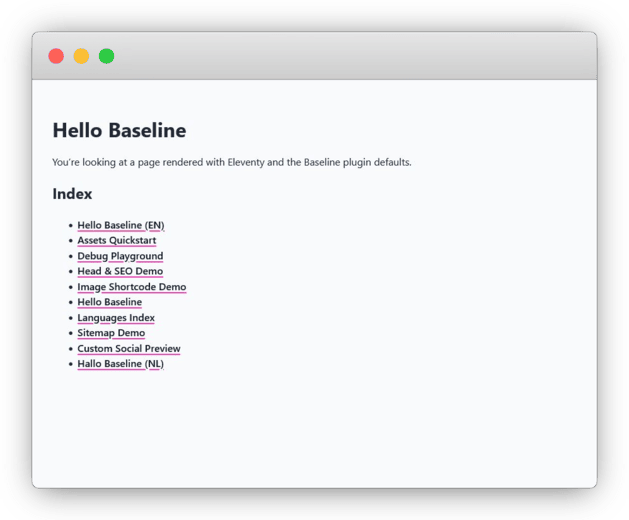

# Simple Baseline Site

This is the completed tutorial site for [Eleventy Plugin Baseline](https://eleventy-plugin-baseline.netlify.app/). This complete edition also features selected How-To chapters, rounding up the learning experience.



## Install locally

1. Git clone the repo:  

   ```bash
   git clone https://github.com/apleasantview/simple-baseline-site.git
   cd simple-baseline-site
   npm install
   ```

2. Run Eleventy in server mode:  

   ```bash
   npx rimraf dist/ && npm run dev
   ```

3. Run Eleventy in build mode:  

   ```bash
   npx rimraf dist/ && npm run build
   ```

## Navigating tutorials

A git tag marks a completed tutorial chapter. Commits are made in linear fashion, following the online tutorial steps. Use the GitHub tag feature or preferred method to jump between completed tutorials. 
